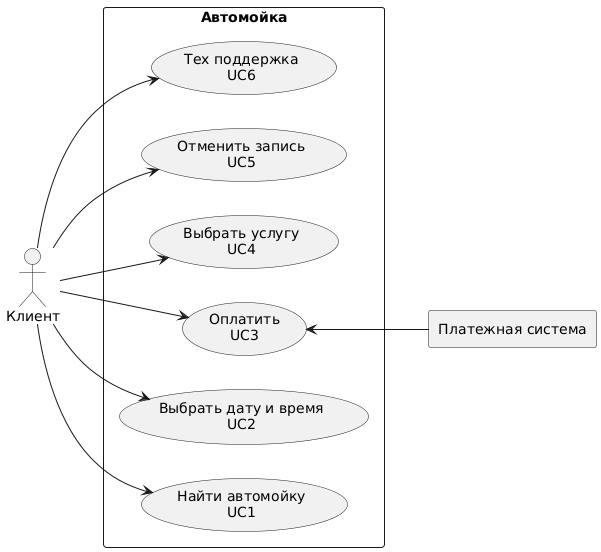

# Учебное приложение по автомойке
Интеграция Информационных Систем  

## Estimates (Примерные показатели):
  <table>
  <tr>
    <td>Регион</td>
    <td>Сахалинская область</td>
  </tr>
  <tr>
    <td>Численность региона</td>
    <td>500К человек</td>
  </tr>
  <tr>
    <td>DAU</td>
    <td>15% от 500К = 75К </td>
  </tr>
  <tr>
    <td>RPS</td>
    <td>75K/24/3600 ~= 1</td>
  </tr>
</table>

## Функциональные требования:
 
### Сценарии использования
#### UC1: Найти автомойку
 <table>
  <tr>
    <td>Участники</td>
    <td>Пользователь приложения</td>
  </tr>
  <tr>
    <td>Предусловия</td>
    <td> Пользователь зарегистрирован и авторизован</td>
  </tr>
  <tr>
    <td>Условия для срабатывания</td>
    <td>Пользователь нажимает кнопку "Найти мойку"</td>
  </tr>
  <tr>
    <td>Признак успешности</td>
    <td>Пользователь выбрал автомойку</td>
  </tr>
</table>

##### Базовый сценарий:
1. Система проверяет, что клиент передал свою геолокацию. 
ЕСЛИ: Геолокации нет, 
ТО: Система переходит к базовому сценарию 3.
2. Система ищет ближайшие к позиции клиента мойки. ([AL01](#al01-алгоритм-поиска-моек-по-адресу-или-геолокации))
3. Формируется список моек.
4. Система отображает "Экран с картой и списком моек". ([UI_01](#ui_1-экран-с-картой-и-списком-моек))
5. Система ожидает выбора мойки клиентом.
6. Система переходит к [UC4](#uc4-выбрать-услугу).
7. Сценарий завершен.

##### Базовый сценарий 2:
1. Система выводит сообщение клиенту с просьбой разрешить передачу геолокации.
2. ЕСЛИ: клиент разрешил передачу геолокации. 
ТО: Система переходит в "Базовый сценарий шаг 2". 
ИНАЧЕ: Система переходит в "Базовый сценарий 3".

##### Базовый сценарий 3:
1. Система отображает поле для ввода адреса.
2. Система ожидает от пользователя ввод адреса.
3. Система переходит в "Базовый сценарий шаг 2.

<!-- ///////////////////////////////////////////////////////////////////////////////////////////////////////////////////////////// -->

#### UC2: Выбрать дату и время

<table>
  <tr>
    <td>Участники</td>
    <td>Пользователь приложения</td>
  </tr>
  <tr>
    <td>Предусловия</td>
    <td> Пользователь зарегистрирован и авторизован. Услуги и автомойка выбраны</td>
  </tr>
  <tr>
    <td>Условия для срабатывания</td>
    <td>Пользователь нажимает кнопку "Выбрать дату"</td>
  </tr>
  <tr>
    <td>Признак успешности</td>
    <td>Пользователь выбрал дату и время</td>
  </tr>
</table>

##### Базовый сценарий:
1. Система проверяет, выбрал ли пользователь автомойку.
2. Система проверяет, наличие выбранных услуг.
3. Система запрашивает доступное время на мойке из БД.
4. Система оценивает время исходя из выбранных услуг.
5. Система формирует периоды времени, в которые пользователь может быть обслужен.
6. Система отображает "Экран с доступным временем". ([UI_02](#ui_2-экран-с-доступным-временем))
7. Система ожидает выбора мойки клиентом.
8. Система резервирует выбранное время в БД.
9. Система переходит к [UC3](#uc3-оплатить).
10. Сценарий завершен.

<!-- ///////////////////////////////////////////////////////////////////////////////////////////////////////////////////////////// -->

#### UC3: Оплатить

<table>
  <tr>
    <td>Участники</td>
    <td>Пользователь приложения</td>
  </tr>
  <tr>
    <td>Предусловия</td>
    <td> Пользователь зарегистрирован и авторизован. Услуги, автомойка и время и дата выбраны.</td>
  </tr>
  <tr>
    <td>Условия для срабатывания</td>
    <td>Пользователь нажимает кнопку "Оплатить" и выберет способ оплаты</td>
  </tr>
  <tr>
    <td>Признак успешности</td>
    <td>Оплата прошла успешна</td>
  </tr>
</table>

##### Базовый сценарий:
1. Система проверяет наличие выбранных пунктов "Автомойка", "Услуги" и "Дата и время".
2. Система формирует итоговый вариант записи пользователя.
3. Система отображает экран "Итоговый вариант записи". ([UI_3](#ui_3-экран-с-доступным-временем))
4. Система ожидает выбора способа оплаты.
ЕСЛИ: Способ оплаты - "Онлайн оплата".
ТО:  Работа с API платежной системы.
6. Формируется номер записи.
7. Запись помещается в БД и в очередь автомойки.
8. Отображение сообщения о том, что запись успешно сформирована.
9. Сценарий завершен.

<!-- ///////////////////////////////////////////////////////////////////////////////////////////////////////////////////////////// -->

#### UC4: Выбрать услугу

<table>
  <tr>
    <td>Участники</td>
    <td>Пользователь приложения. </td>
  </tr>
  <tr>
    <td>Предусловия</td>
    <td> Пользователь зарегистрирован и авторизован. Автомойка выбрана.</td>
  </tr>
  <tr>
    <td>Условия для срабатывания</td>
    <td>Пользователь нажимает кнопку "Услуги"</td>
  </tr>
  <tr>
    <td>Признак успешности</td>
    <td>Пользователь выбрал услугу(-и)</td>
  </tr>
</table>

##### Базовый сценарий:
1. Система проверяет наличие выбранных пунктов "Автомойка".
2. Система запрашивает список доступных услуг на автомойке у БД.
3. Система отображает "Список доступных услуг". ([UI_4](#ui_4-экран-с-доступным-временем))
4. Система ожидает выбора пользователя.
5. Система переходит к  [UC2](#uc2-выбрать-дату-и-время)
6. Сценарий завершен.

<!-- ///////////////////////////////////////////////////////////////////////////////////////////////////////////////////////////// -->

#### UC5: Отменить запись

<table>
  <tr>
    <td>Участники</td>
    <td>Пользователь приложения</td>
  </tr>
  <tr>
    <td>Предусловия</td>
    <td> Пользователь зарегистрирован и авторизован. Имеет запись в автомойку.</td>
  </tr>
  <tr>
    <td>Условия для срабатывания</td>
    <td>Пользователь нажимает кнопку "Отменить запись"</td>
  </tr>
  <tr>
    <td>Признак успешности</td>
    <td>Пользователь отменил активную запись</td>
  </tr>
</table>

##### Базовый сценарий:
1. Система запрашивает у БД активные записи пользователя.
2. Система отображает "Экран списка активных записей". ([UI_5](#ui_5-экран-с-доступным-временем))
3. Система ожидает выбора пользователем записи на отмену.
4. Система получает номер записи и делает запрос на ее отмену в БД.
5. Система выводит сообщение о том, что запись успешно отменена.
6. Сценарий завершен.

<!-- ///////////////////////////////////////////////////////////////////////////////////////////////////////////////////////////// -->

#### UC6: Техническая поддержка

<table>
  <tr>
    <td>Участники</td>
    <td>Пользователь приложения, тех. поддержка</td>
  </tr>
  <tr>
    <td>Предусловия</td>
    <td> Пользователь зарегистрирован и авторизован</td>
  </tr>
  <tr>
    <td>Условия для срабатывания</td>
    <td>Пользователь нажимает кнопку "Техническая поддержка"</td>
  </tr>
  <tr>
    <td>Признак успешности</td>
    <td>Пользователь связался с технической поддержкой</td>
  </tr>
</table>

##### Базовый сценарий:
1. Система получает список свободных сотрудников тех. поддержки.
2. Система формирует чат пользователя и одного из свободных сотрудников.
3. Система отображает "Чат технической поддержки". ([UI_6](#ui_6-экран-с-доступным-временем))
4. Система организует передачу сообщений между пользователем и технической поддержкой.
5. Сценарий завершен.

<!-- ///////////////////////////////////////////////////////////////////////////////////////////////////////////////////////////// -->

### Альтернативные сценарии:
AC_1. Некорректный запрос пользователя.  
АС_2. Обрыв соединения приложения с Интернетом\ Отсутствует подключение к серверу.  
АС_3. Упала БД 
AC_4. Попытка двух пользователей записаться на одно время.

## Нефункциональные требования:

### AL01 Алгоритм поиска моек по адресу или геолокации
1. Система формирует запрос в БД
2. ...
3. ...
4. Система возвращает список моек сценарию, который вызвал алгоритм

## Интерфейсы:

### UI_1 "Экран с картой и списком моек"

### UI_2 "Экран с доступным временем"

### UI_3 "Экран с доступным временем"

### UI_4 "Экран с доступным временем"

### UI_5 "Экран с доступным временем"

### UI_6 "Экран с доступным временем"

